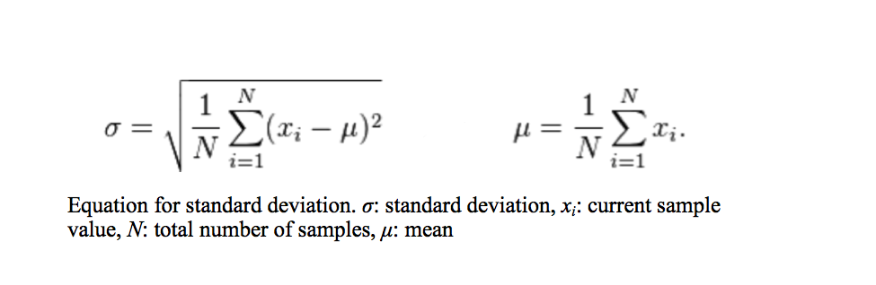
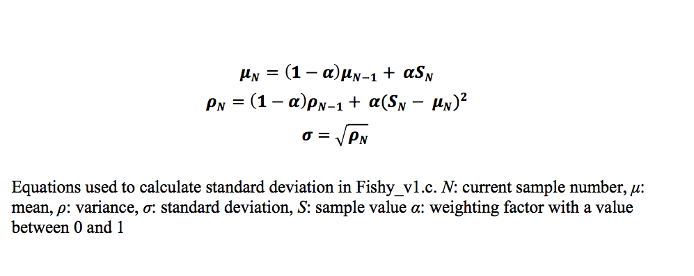

############
Run Modes and Data Storage
############

Even though the entire memory buffer is read, what information is stored depends on the operational mode chosen by the user. There are two different run modes: Run Mode 0, which collects raw data, and Run Mode 1, which collects only EODs. The data is saved to a .EOD file whose format changes depending on the selected operation mode. Both operation modes contain the same header at the beginning of a file. The header includes a description of the file itself and the metadata, which contains information on both the subject and experimental set-up. After the header, the actual data values are written to the file. If Run Mode 0 is chosen, the data will consist of a continuous string of data values. If Run Mode 1 is chosen, the timestamp will be printed followed by the corresponding EOD values. Unlike in Run Mode 0, each timestamp and EOD is printed on a new line. All data besides the header is saved as hexadecimal values to reduce file size. 

Details on Run Mode 1

When Run Mode 1 is selected, an additional file is created. Unlike the .EOD file, this file is not permanent. The file contains only the separate EODs which are written as space-separated values. This file is used to create a pop-up window that graphs the EODs using gnuplot. The separate EOD traces are overlaid, allowing the user to get a preview of the waveforms that are being recorded or determine if there are issues with the set-up. This file is then deleted at the end of the program to conserve memory space. 

In Run Mode 0 every data point that is read is saved to a file; however, if Run Mode 1 is chosen only the EODs should be saved. The program determines and EOD has occurred if a threshold has been reached. The threshold is calculated based on standard deviation, which is normally calculated using on the equation:

Unfortunately using this method to calculate standard deviation in not possible. The program is written in the C programming language and a datatype of “int” is assigned to both the value of the sample and the value of the mean. The highest value of an “int” datatype is +2147483647. An amplitude of 0 V corresponds to a value of 2048 when digitized. If a constant 0 V is fed to the analog to digital converter, at a maximum sampling rate of 1 Msps the sum of the sample values will exceed the maximum value in a little over one second. Because of this, the threshold must be calculated using an exponential moving mean and standard deviation using the equations below.

The closer the value of (1 – α) is to 1, the larger the impact the previous values have and the less impact each new sample has on the mean or variance. For this program, α was chosen to have a value of 0.000001, so that samples that deviate greatly from the zero line, like the values that make up EODs, do not alter the mean significantly, keeping the mean constant. The same idea is applied to the variance. This approach causes a time delay before the mean reaches a constant value, requiring a mean to be established before checking for EODs. At the beginning of the code, the program pauses to allow a sufficient amount of data points to be available before calculating an initial mean. The initial mean is calculated by summing the first one thousand data points and dividing by the same number of data points. Once the initial mean has been calculated, the buffer is reread from the beginning and analyzed for EODs. An EOD is detected by comparing the value of the current data point to the threshold. If the value is greater than or equal to the threshold, then the deviation from the mean is considered significant and an EOD has occurred. If an EOD is detected, a timestamp, indicating when the EOD occurred, and a 2 ms time window of data is recorded with the peak amplitude of the EOD centered in the window. When writing the data to the file, similar situations occur as described when reading the data from the memory and are handled in the same manner. 