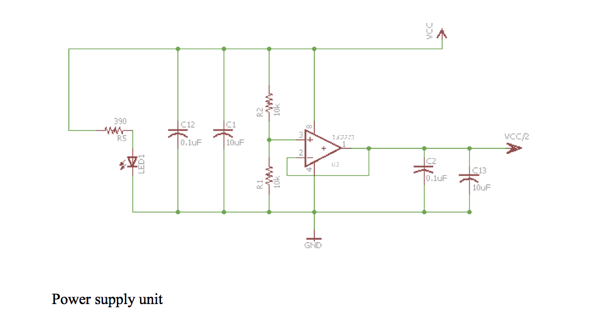
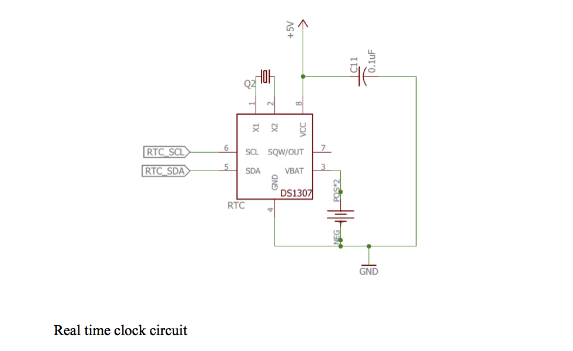
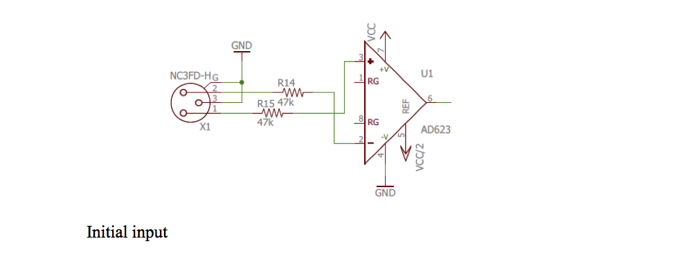
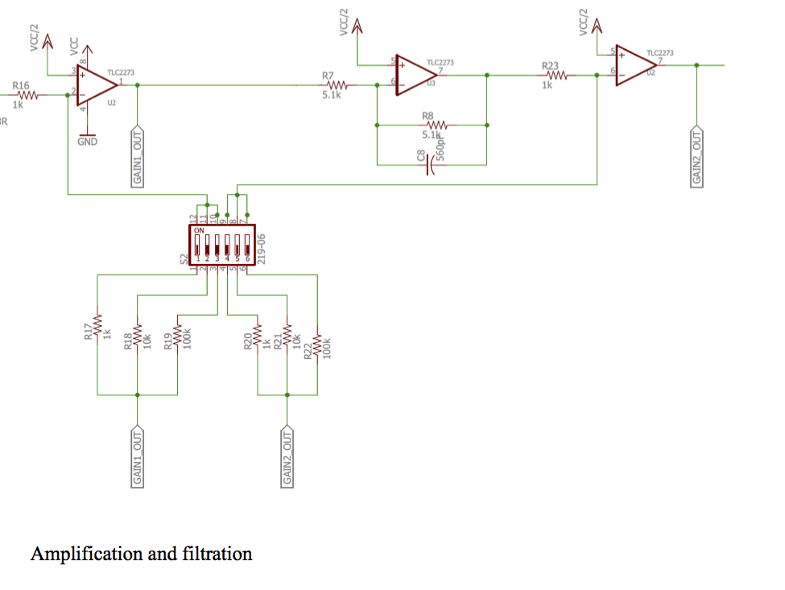
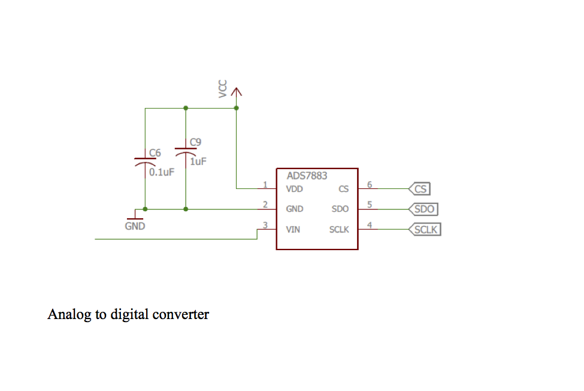
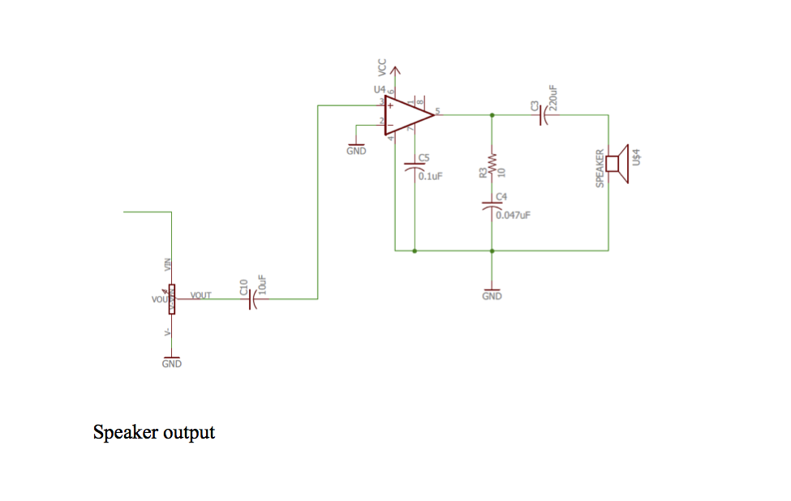

############
Device Details and Specifications
############

The shield that attaches to the BBB contains the entire circuit that is responsible for amplifying and digitizing the signal. This circuit is based on the Backyard Brains Muscle SpikerBox and has been modified for the purposes of this project. The circuit can be broken down into several subunits that perform individual functions. 

=================
Power Supply
=================

The first subunit of this circuit is the power supply unit, which creates a constant supply of the voltage supply divided by two. 

This unit is largely unchanged from the original design. Additional decoupling capacitors, C1 and C12, have been added and preexisting ones, C2 and C13 have been reconfigured. C1 and C12 stabilize the supply voltage, VCC, by removing any high frequency oscillations from the signal. C2 and C13 do the same for VCC/2. The LED is used as a visual cue to tell the user when the shield is being powered. The constant VCC/2 output from the op-amp is accomplished using a negative feedback amplifier circuit. Connecting the output of the amplifier to the inverting input should result in an output that follows closely to the non-inverting input. As the non-inverting input voltage input increases, the output voltage increases with accordance to the differential gain. Because the output voltage is fed back into the inverting input of the op-amp, the difference between the inputs will decrease causing the output voltage to decrease. Over time this stabilizes to output a voltage nearly equal to the non-inverting input voltage, but still low enough that the difference between the two inputs can generate the output voltage.

.. note:: Currently, the entire shield is powered by the 3.3 V output from the BBB. The BBB itself is powered by a laptop via a microUSB, limiting where and how the device can be used.  The board can be modified in the future to provide power through a battery.

=================
Real Time Clock (RTC)
=================

The second subunit is the real time clock (RTC) circuit. The BBB does not have an onboard RTC circuit, making it incapable of keeping the date and time. The filenames depend on the date and time an experiment is performed making it necessary to add a separate RTC circuit to the board itself.

The RTC chip is supplied with 5V from the BBB, with C11 as a decoupling capacitor, from the BBB to enable it to communicate with the microcontroller. An additional 3 V coin-cell battery is used to allow the RTC to retain the date and time when it is not being powered by the BBB. A quartz crystal regulates the electronic frequency oscillator. This keeps the oscillator at a very precise frequency, resulting in a highly accurate clock. RTC_SCL and RTC_SDA connect to input pins on the BBB and are the communication lines between the RTC circuit and the microcontroller. In some designs, there are 2.2 kΩ resistors between RTC_SCL and the supply voltage, and RTC_SDA and the supply voltage. Removing these resistors makes the BBB to use internal pullup resistors, forcing the BBB to communicate at 3.3 V instead of 5 V thus preventing the BBB from damage. 

=================
Amplifier
=================
The next subunit is the circuitry which takes in and amplifies the EODs. This subunit will be broken down into sections and described individually. The first subsection is where the signal is input into the circuit. 

The signal is inputted into the circuit through an XLR connector and consists of a positive input, negative input, and ground. The positive and negative inputs are connected to the non-inverting and inverting inputs of the differential op-amp respectively. This op-amp outputs the difference between the non-inverting and inverting inputs with a gain of one.  The circuit contains two stages of amplification. The first stage amplifies the signal before filtration occurs to reduce the amount of noise that is amplified. The signal is then amplified further to achieve the desired amount of amplification. 

The user can control the amount of gain in each stage using a dip switch to select gains of 1X, 10X, or 100X. The first three switches alter the gain of the first stage, and the last three alter the gain of the second stage. Only one switch from each group should be in the “ON” position to obtain the designated gains. If more than one switch in each region is in the “ON” position, resistors would be put in parallel, altering the amount of gain. The total amount of gain is calculated by multiplying the gain of stage one with the gain of stage two. This results in a gain range of 1X to 10,000X. The filtering stage is a single order low-pass filter with a cut-off frequency of 55 kHz. The dB amplitude of the signal will begin to noticeably decay around when the frequency of the signal passes 10 kHz. The EODs being studied are around 1 kHz, making this design suitable for the project’s purposes. The amplification and filtering stages are comprised of inverting amplifiers, meaning the signal experiences a 180° phase shift every time it passes through an op-amp. Additionally, an offset voltage, VCC/2, is applied to each op-amp essentially shifting the zero line from 0 V to VCC/2. This is required because the analog to digital converter is not capable of reading negative voltages, and would therefore not see the negative deflections of the waveforms.

=================
Analog to Digital Conversion
=================

After the signal has been amplified and filtered, it is passed to the analog to digital converter (ADC) where it is digitized and sent to the BBB to be processed. The wiring for the ADC is shown below.

The ADS7883 is capable of sampling up to 1 Msps and as low as 100 ksps. As previously discussed, the sampling rate, can be altered in the software. This added flexibility allows the user to determine how detailed the digitized waveform will be. If the user only wants a preview of the waveform, a lower sampling rate can be chosen so as to not waste memory space. 

=================
Speaker Output
=================
The final unit of the circuit is a speaker output. The output from the final stage of amplification is first fed through a 10 kΩ potentiometer. The potentiometer is a variable resistor that can be physically adjusted by the user to control the amplitude of the sound. This op-amp does not need an offset voltage as the speaker is an analog device. The speaker is useful for determining if the experimental set-up is correct. If the probe is close enough to the fish, the EODs will make a clicking sound on the speakers.

