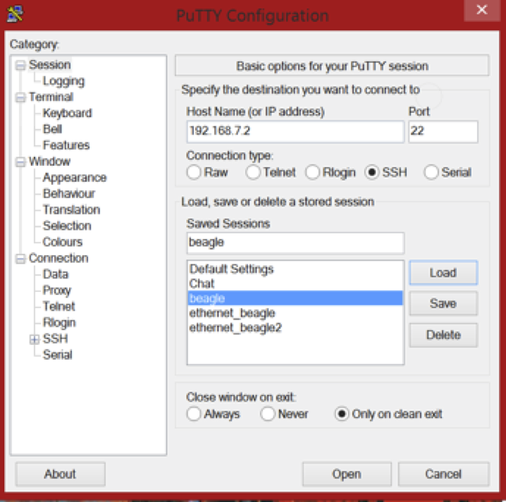

############
Getting Started
############

Before connecting the BeagleBone, go to https://beagleboard.org/getting-started and download the drivers for your computer.
The BeagleBone Black will come with a USB to microUSB that can be used to both power and communicate with the BeagleBone. Using the microUSB ssh into the BeagleBone through PuTTy or another SSH client. The IP address for logging in over the microUSB is 192.168.7.2 and is standard for each BeagleBone. The BeagleBone is also accessible over Ethernet and WiFi; however, the IP address will be unique to each BeagleBone when using these methods and that will be discussed later. The login window for PuTTy is shown below.

Sessions can be saved after entering the IP address by entering a name in the “Saved Sessions” box and clicking on the “Save” button. Doing this will not only save the IP address information, but any settings that you have altered under the categories listed on the left. Log in to the BeagleBone as “root”. Once you have logged in, the BeagleBone will ask for a password. By default there is none and hit “Enter” to continue. Now you are within the BeagleBone’s Debian Linux system.  
Additionally, it is useful to easily transfer and navigate the files stored on the BeagleBone. The file system can be navigated using Linux commands; however, it is not as easy to transfer the files between the BeagleBone and your computer from the command line. For this reason, a SFTP client is recommended. A list of applications for both Windows and OS X is in Appendix A. The login is similar to when using PuTTy.