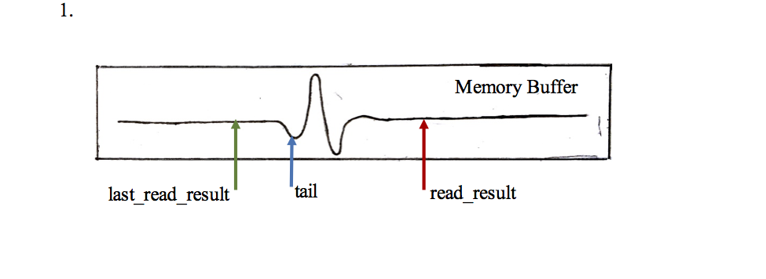
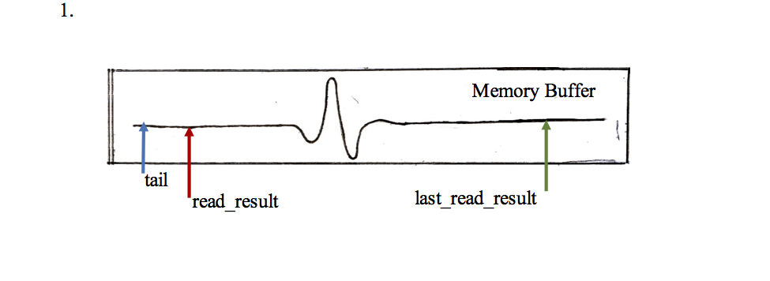

############
Utilizing Programmable Real-Time Units (PRUs)
############

The BBB runs a Debian Linux operating system which is not preemptive and cannot interrupt a kernel code once it begins executing. This causes an issue, as it does not allow for data collection in real time if the software is run on the main processor. To overcome this issue I had to make use of the processor’s programmable real time units (PRU). The PRUs operate as shown:

First, a device tree overlay must be created and applied that configures and enables the GPIO pins. Then two different codes need to be written. The PRU code (Fishy.p) instructs the PRU on how to operate. This code is compiled in to a PRU program binary which can be interpreted by the PRU. The Linux host program (Fishy_v1.c) loads the PRU program binary to the PRU. The host program also communicates between the PRU and the Linux host. It is responsible for receiving and sending interrupts to and from the PRU. The PRU code is written in the assembly language and instructs the PRU to write the digitized data to a memory buffer. The buffer is only large enough to hold four seconds of data when the highest sampling rate is selected. Originally, the PRU code was written so that the program would end once the buffer was full; however, it is necessary to record more than four seconds of data. The program has been modified to create a circular buffer, so when the memory buffer is filled, the PRU returns to the beginning of the buffer and overwrites the previous data.

As mentioned earlier, the Linux host program transfers the PRU binary and acts as a communication bridge between the PRU and the Linux host. When the memory buffer was finite, the host program only loaded the PRU binary to the PRU and a separate program was written to retrieve the data from the memory. Now that the memory buffer is circular and data analysis is required to occur in real time, the host code had to be altered to both read and analyze the data in the memory buffer as it was being written. In order to read the memory buffer, the buffer needs to be broken into segments that are read through individually.  The current memory address is denoted as the variable “tail”, the beginning of the buffer segment is denoted as the variable “last_read_result” and the end of the segment is denoted as the variable “read_result”. By breaking the buffer into segments two situations can occur:

1. read_result > last_read_result

In this situation the process is quite simple. A “for loop” iterates from last_read_result to read_result. With each iteration, the value stored in the memory address at tail is read and tail_position, position of the tail in the memory buffer, is moved two bytes. Once the end of the loop is reached last_read_result is set to read_result and the two are compared again. If the comparison reveals the same situation, the process is repeated.

2. read_result < last_read_result

In this situation arises when read_result reaches the end of the memory buffer and loops back around, but last_read_result has reached the end yet. In this situation a two part copy needs to be made. First the difference between the end of the buffer and last_read_result is calculated. A “for loop” iterates through these end point in the same manner as described in Situation 1. The program then iterates through another for loop that starts at the start of the buffer and ends at read_result. 